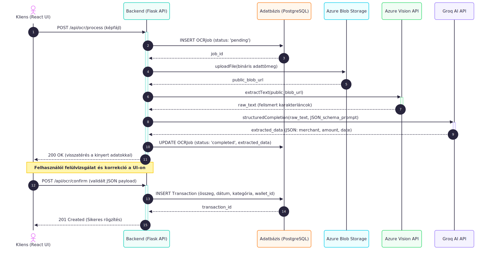

# A Finance Tracker szoftverarchitektúrája és üzleti logikája

## 1. A szoftverarchitektúra áttekintése

A Finance Tracker alkalmazás egy elosztott, kliens-szerver modellre épülő, **háromrétegű (3-tier) webalkalmazás**. Az architekturális döntés elsődleges célja a felelősségi körök szigorú elkülönítése (Separation of Concerns), amely elősegíti a kód modularitását, a jövőbeli karbantarthatóságot, valamint a komponensek független skálázhatóságát és tesztelhetőségét.

A rendszer az alábbi strukturális rétegekből (tiers) tevődik össze:

* **Kliensoldali megjelenítési réteg (Presentation Layer / UI):**
    A web böngészőben futó Single Page Application (SPA), amely React 18, TypeScript és a Material-UI (MUI) komponenskönyvtár felhasználásával készült. Felelősségi köre a végfelhasználói felület biztosítása, a DOM (Document Object Model) dinamikus manipulációja és a kliensoldali állapotkezelés (state management). Ez a réteg felel a bemeneti adatok első szintű (szintaktikai) validációjáért, a kliensoldali útvonalválasztásért (routing), valamint a kiszolgálóoldali RESTful API végpontokkal történő aszinkron HTTP kommunikációért.
* **Kiszolgálóoldali üzleti logikai réteg (Business Logic Layer / BLL):**
    A Docker konténerben futó, Python 3.11 és Flask keretrendszer alapú szerver, amely a rendszer API gateway-eként és elsődleges adatfeldolgozójaként funkcionál. Feladatai közé tartozik a JWT (JSON Web Token) alapú, állapotmentes (stateless) hitelesítés és autorizáció, az üzleti szabályok kikényszerítése, a kérések szemantikai validációja, valamint a külső felhőszolgáltatások (Azure Vision API, Groq AI API) felé irányuló hálózati kommunikáció és adatintegráció orkesztrálása.
* **Adatelérési és perzisztencia réteg (Data Access Layer / DB):**
    Az adatok tartós (perzisztens) és konzisztens tárolásáért felelős réteg. A relációs adatok elérését a PostgreSQL adatbázis-kezelő és az SQLAlchemy ORM (Object-Relational Mapping) biztosítja, amely adatbázis-független objektum-kezelést tesz lehetővé, megelőzve a közvetlen SQL injekciós sebezhetőségeket. A nagy méretű, strukturálatlan bináris adatok (képek, dokumentumok) tárolását egy dedikált felhőalapú objektumtároló (Azure Blob Storage) végzi, tehermentesítve ezzel a relációs adatbázist.

---

## 2. Logikai adatmodell és Osztálydiagram

A rendszer adatmodellje a pénzügyi nyilvántartás alapvető entitásaira és azok kapcsolataira épül. Az alábbi UML osztálydiagram a rendszer alapvető osztályait, azok attribútumait, metódusait, valamint a köztük lévő navigálhatósági és asszociációs kapcsolatokat modellezi.

**Kardinalitás és entitás-kapcsolatok elemzése:**

* **User - Wallet (1:N asszociáció):** Egy `User` entitáshoz nulla vagy több `Wallet` (pénztár) tartozhat, azonban a referenciális integritás szabályai szerint minden `Wallet` entitásnak pontosan egy dedikált tulajdonosa (`owner_id`) van.
* **Wallet - Transaction (1:N kompozíció):** Egy pénztár több tranzakciót is tartalmazhat. Ez egy erős életciklus-függőségi (kompozíciós) kapcsolat: a konténer objektum (`Wallet`) megsemmisülése esetén a relációs adatbázis szintjén a hozzá tartozó `Transaction` entitások is kaszkádolva (ON DELETE CASCADE) törlődnek, elkerülve az árva rekordok létrejöttét.
* **User - Transaction (1:N asszociáció):** A rendszer minden tranzakció esetén rögzíti az azt létrehozó felhasználó azonosítóját (`created_by`), amely az auditálás és a csoportos pénztárak (Group Wallet) esetén a költségelosztás alapfeltétele.

---

## 3. Üzleti logika és Rendszerintegráció (OCR Pipeline)

Az alkalmazás üzleti logikájának magját a pénzügyi entitások tranzakcionális kezelése, valamint az aszinkron adatfeldolgozási folyamatok alkotják. A legkritikusabb és legösszetettebb adatáramlási láncolat az optikai karakterfelismerésre (OCR) és a mesterséges intelligencia alapú adatkinyerésre épülő nyugtafeldolgozási pipeline.

Ez a folyamat több független komponens – a kliensoldali megjelenítő réteg, a szerveroldali üzleti logika, a relációs adatbázis és három különálló felhőszolgáltatás – szigorúan szabályozott interakcióját igényli. Az alábbi UML szekvenciadiagram a bemeneti képfájl feltöltésétől a végleges pénzügyi tranzakció adatbázisban történő perzisztálásáig tartó teljes életciklust ábrázolja.

**A szekvenciadiagram lépéseinek technikai elemzése:**

1.  **Iniciálás és Aszinkron Állapotkezelés (1-2. lépés):** A folyamat a felhasználó HTTP POST kérésével indul, amely a nyugta bináris adatát továbbítja. A szerver azonnal egy új, `pending` (folyamatban) állapotú `OCRJob` rekordot generál az adatbázisban. Ez az architektúra biztosítja, hogy esetleges hálózati hiba vagy timeout esetén a munkafolyamat állapota nyomon követhető maradjon.
2.  **Képi adat perzisztálása (3-4. lépés):** A bináris fájlok az Azure Blob Storage-ban kerülnek tárolásra. A feltöltést követően a szolgáltatás egy URL-t biztosít a további feldolgozás hivatkozási pontjaként.
3.  **Optikai karakterfelismerés és Adatkinyerés (5-8. lépés):** A backend elsőként az Azure Vision API-t hívja meg, amely a képi struktúrát strukturálatlan szöveggé (`raw_text`) alakítja. Mivel a nyugták formátuma heterogén, a rendszer ezt a szöveget egy "JSON Schema" prompt kíséretében továbbítja a Groq AI API-nak. A nyelvi modell azonosítja és strukturálja a releváns entitásokat (kereskedő neve, tranzakció dátuma, végösszeg).
4.  **Adatvisszaadás és Validáció (9-10. lépés):** Az üzleti logika frissíti az `OCRJob` rekordot `completed` státuszra, a kinyert JSON struktúrát pedig visszaküldi a kliensnek. A rendszer kikényszeríti a *Human-in-the-Loop* (emberi beavatkozás/ellenőrzés) paradigmát: nem hajt végre automatikus tranzakció-létrehozást a magas adatintegritás érdekében.
5.  **Véglegesítés (11-14. lépés):** A végfelhasználó által a kliensoldalon jóváhagyott adatok a szerverre érkezve véglegesítésre kerülnek. Megtörténik a `Transaction` entitás rögzítése a tranzakciós naplóba, beágyazva a megfelelő referenciális azonosítókat.